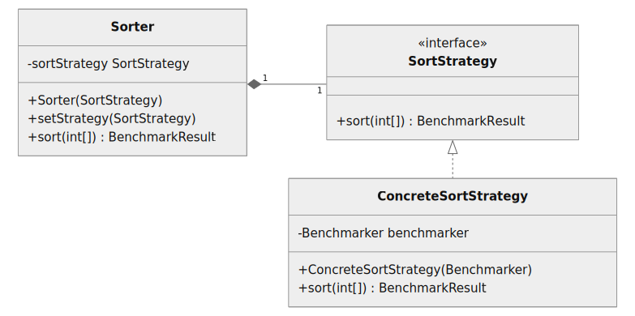
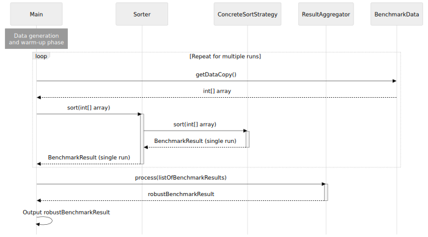

<!--
Repository description: Microservice sorting benchmark: API backend & React frontend for interactive results.

Repository topics: java, docker, benchmark, sorting, algorithm, microservices, reactjs, rest-api.
-->

# Sorting Algorithm Benchmark

This project compares the performance of various sorting algorithms. The algorithms are implemented in Java.

## Purpose

The goal is to analyse and visualise the efficiency of different common sorting algorithms under various conditions.

## Key Features

- Scalable, distributed and modular architecture
- Performance comparison of sorting algorithms
- Customisable input data generation
- Reproducible containerised benchmarks
- Standardised REST API
- Interactive `React.js` result visualisation

Effortless setup and execution for quick benchmarking.

## Table of Contents

*TOC will go here*

## Getting Started

This project is designed for quick and easy setup. Through containerised deployment, you can have the benchmark running with a single command.

1. Clone the respository

    ```bash
    git clone https://github.com/rlacher/sort-algorithms.git
    ```

2. Navigate to the project directory
    ```bash
    cd sort-algorithms
    ```

2. Execute the application

    ```bash
    ./gradlew clean && ./gradlew run
    ```

3. *Instructions on how to configure the analysis will follow*

## Technical Details

### Benchmark Details

**GUI:**

This benchmark provides an interactive GUI that allows users to customise benchmark parameters.

*Describe: GUI overview, user-selectable params, benchmark execution.

**Input data characteristics:**

This benchmark assesses sorting algorithms performance on primitive integer arrays (`int[]`).

- *Max Performance:* Direct memory access, no boxing.
- *Core Algorithm Focus:* Isolates sorting efficiency.
- *In-Place Sorting:* Minimal memory use.

**Environment:**

Benchmarks run within a Docker container to minimise background process interference and ensure a consistent environment. The container is configured with default JVM settings and a single thread.

To minimise resource contention, the backend container is configured with:
* CPU limits: 2 cores
* Memory limits: 4GB
* CPU affinity: container process pinned to core
* Process priority: `renice`

For ease of use, both containers can be run on the same `Docker` daemon. However, for maximum benchmarking precision, a dedicated daemon for the backend container is recommended.

This project is built and tested with the following environment:

- *Operating System:* Ubuntu 24.04.1 LTS
- *Java:* OpenJDK 21.0.6
- *Gradle:* 8.13
- *JUnit:* 5.13
- *Mockito:* 5.17

### Benchmark Methodology

**Execution:**

**Data generation:**

**Measurement:**

- *Execution time:* Measured by profiling the sort operation's runtime.
- *Data writes:* Counted directly within the sorting algorithm's code by tracking the number of element writes (swaps, shifts, and inserts).
- *Memory usage:* JVM heap memory consumption, measured at key points during the sorting process.

**Algorithm implementation:**

The following sorting algorithms are implemented in Java to sort in ascending order.

| **Algorithm** | **Description** | **Implementation**
| --- | --- | --- |
| Bubble Sort| Performs iterative passes through the array, comparing adjacent elements and swapping them if out of order. | Standard in-place. |
| Heap Sort | Leverages a heap data structure to sort an array by repeatedly extracting the root element and placing it in its final position. | Max heap is built bottom-up from the last non-leaf node. The `heapify` operation is implemented recursively. |
| Insertion Sort | Iteratively builds a sorted array by inserting each unsorted element into its correct position within the sorted portion. | Standard in-place. |
| Merge Sort | Recursively divides an array into smaller subarrays, sorts them, and merges them into a single sorted array. | Recursive top-down implementation with standard two-way merging using an auxiliary array. |
| Quick Sort | Selects a pivot element and partitions the array around it, recursively sorting the sub-arrays on either side of the pivot. | In-place sorting with the leftmost element as the pivot.

### Design

This benchmark project leverages the Strategy pattern to establish a modular and extensible architecture. Consequently, new sorting algorithms can be integrated without requiring modifications to the core benchmarking logic. Performance profiling is conducted by a dedicated `Benchmarker` class, which is injected into individual `SortStrategy` implementations, promoting loose coupling and enhanced code maintainability.




Pre-generated `BenchmarkData`, created upfront by the `BenchmarkDataFactory`, is repeatedly sorted by a chosen `SortStrategy` through the `Sorter`, and the resulting benchmark metrics are robustly aggregated.



### Test

This project features a robust suite of **253 unit tests**, built with JUnit and Mockito, to ensure the reliability and correctness of both the benchmarking framework and sorting routines. The testing strategy rigorously applies principles such as boundary condition analysis, equivalence class partitioning, exception handling verification, and thorough data flow validation across components.

The current test suite achieves significant coverage, reaching **92% statement coverage** and **90% branch coverage**, demonstrating a strong commitment to code quality and comprehensive testing throughout the project.

**Running Tests:**

1.  Clone the repository (if you haven't already).
2.  Navigate to the project directory in your terminal or command prompt.
3.  Build the project (to ensure dependency resolution):
    ```bash
    ./gradlew build
    ```
4.  Run the Gradle test task:
    ```bash
    ./gradlew test
    ```

**Viewing Test Coverage:**

After the tests complete, an HTML report will be generated in the `build/reports/jacoco/testReport/html` directory. Open the `index.html` file in your web browser to explore the coverage details.

## Benchmark Results

## Discussion

- A strong positive correlation exists between runtime and the number of data write operations performed. However, while runtime is an empirical measure, the number of swaps serves to verify the theoretical complexity and inherent efficiency of the algorithm, being a measure independent of specific hardware and the execution environment.
- Despite their similar O(n log n) average-case scaling, quicksort frequently outperforms heapsort and mergesort in practice. This is largely attributed to its smaller constant factors, resulting from fewer swaps and improved cache locality compared to the overhead of heap maintenance and the extensive data movements associated with mergesort's auxiliary arrays.

## License

This project is licensed under the MIT License - see the [LICENSE](LICENSE) file for details.

## Author

Created by [René Lacher](https://github.com/rlacher).