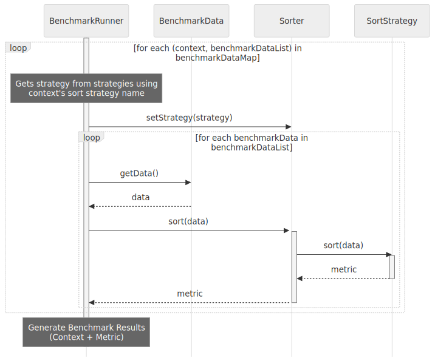

<!--
Repository description: Microservice sorting benchmark: API backend & React frontend for interactive results.

Repository topics: java, docker, benchmark, sorting, algorithm, microservices, reactjs, rest-api.
-->

# Sorting Algorithm Benchmark

<!-- Badge ordering: Status, legal, deployment -->
[](https://github.com/rlacher/sort-benchmark/actions/workflows/ci.yml)
[](https://opensource.org/licenses/MIT)

Explore the nuances of sorting algorithm efficiency through this interactive benchmark application. Built with a Java API and a dynamic React.js visualisation layer, this architecture enables a scalable and containerised environment to scrutinise performance metrics across various scenarios.

## Table of Contents

- [Table of Contents](#table-of-contents)
- [Purpose](#purpose)
- [Key Features](#key-features)
- [Getting Started](#getting-started)
- [Benchmark Details](#benchmark-details)
    - [GUI](#gui)
    - [Input data characteristics](#input-data-characteristics)
    - [Environment](#environment)
- [Benchmark Methodology](#benchmark-methodology)
    - [Benchmark Configuration](#benchmark-configuration)
    - [Data Generation](#data-generation)
    - [Algorithm Implementations](#algorithm-implementations)
    - [Execution](#execution)
    - [Measurement](#measurement)
    - [Result Aggregation](#result-aggregation)
- [Design](#design)
    - [Class Diagram: Strategy pattern for Sorting Routines](#class-diagram-strategy-pattern-for-sorting-routines)
    - [Sequence Diagram: Benchmark Run](#sequence-diagram-benchmark-run)
    - [Sequence Diagram: BenchmarkRunner.runIterations](#sequence-diagram-benchmarkrunnerruniterations)
- [Test](#test)
    - [Running Unit Tests](#running-tests)
    - [Viewing Test Coverage](#viewing-test-coverage)
- [Benchmark Results](#benchmark-results)
- [Discussion](#discussion)
- [License](#license)
- [Author](#author)

## Purpose

This project aims to equip developers and enthusiasts with an interactive and reproducible tool for benchmarking common sorting algorithms. By comparing their performance characteristics under various data conditions, it provides practical insights into algorithm efficiency, reflecting their use in both industry and academic settings.

## Key Features

- Scalable, distributed and modular architecture
- Performance comparison of sorting algorithms
- Customisable input data generation
- Reproducible containerised benchmarks
- Standardised REST API
- Interactive `React.js` result visualisation

Effortless setup and execution for quick benchmarking.

## Getting Started

This project is designed for quick and easy setup. Through containerised deployment, you can have the benchmark running with a single command.

1. Clone the respository

    ```bash
    git clone https://github.com/rlacher/sort-benchmark.git
    ```

2. Navigate to the project directory
    ```bash
    cd sort-benchmark
    ```

2. Execute the application

    ```bash
    ./gradlew clean && ./gradlew run
    ```

3. *Instructions on how to configure the analysis will follow*

## Benchmark Details

### GUI

This benchmark provides an interactive GUI that allows users to customise benchmark parameters.

*Describe: GUI overview, user-selectable params, benchmark execution.

### Input data characteristics

This benchmark assesses sorting algorithms performance on primitive integer arrays (`int[]`).

- *Max Performance:* Direct memory access, no boxing.
- *Core Algorithm Focus:* Isolates sorting efficiency.
- *In-Place Sorting:* Minimal memory use.

### Environment

Benchmarks run within a Docker container to minimise background process interference and ensure a consistent environment. The container is configured with default JVM settings and a single thread.

To minimise resource contention, the backend container is configured with:
* CPU limits: 2 cores
* Memory limits: 4GB
* CPU affinity: container process pinned to core
* Process priority: `renice`

For ease of use, both containers can be run on the same `Docker` daemon. However, for maximum benchmarking precision, a dedicated daemon for the backend container is recommended.

This project is built and tested with the following environment:

- *Operating System:* Ubuntu 24.04.1 LTS
- *Java:* OpenJDK 21.0.6
- *Gradle:* 8.13
- *JUnit:* 5.13
- *Mockito:* 5.17

## Benchmark Methodology

### Benchmark Configuration

Users can define key aspects of the benchmark execution, such as the algorithms to be tested, the data type for benchmark data generation and the profiling mode. To simplify the initial implementation and avoid overloading the user interface, some configuration parameters, including the number of iterations and data sizes used, are currently defined as heuristic compile-time constants.

### Data Generation

The `BenchmarkDataFactory` provides a single, parameterised entry point, `createData()`, which accepts the data type and length as arguments. Supported data types include `RANDOM`, `SORTED`, `REVERSED`, and `PARTIALLY_SORTED`.  Internally, data is generated using integer stream ranges and the JVM's default random number generator. This approach ensures efficient and reproducible data set creation for benchmarking.

### Algorithm Implementations

The following sorting algorithms are implemented in Java to sort in ascending order.

| **Algorithm** | **Description** | **Implementation**
| --- | --- | --- |
| Bubble Sort| Performs iterative passes through the array, comparing adjacent elements and swapping them if out of order. | Standard in-place. |
| Heap Sort | Leverages a heap data structure to sort an array by repeatedly extracting the root element and placing it in its final position. | Max heap is built bottom-up from the last non-leaf node. The `heapify` operation is implemented recursively. |
| Insertion Sort | Iteratively builds a sorted array by inserting each unsorted element into its correct position within the sorted portion. | Standard in-place. |
| Merge Sort | Recursively divides an array into smaller subarrays, sorts them, and merges them into a single sorted array. | Recursive top-down implementation with standard two-way merging using an auxiliary array. |
| Quick Sort | Selects a pivot element and partitions the array around it, recursively sorting the sub-arrays on either side of the pivot. | In-place sorting with the leftmost element as the pivot.

### Execution

The `BenchmarkRunner` orchestrates the benchmark execution by reading the configuration, delegating data generation to the `BenchmarkDataFactory`, and managing execution based on `BenchmarkContext` instances. This design promotes a clear separation of concerns and allows for flexible benchmark configuration.

### Measurement

- *Execution time:* Measured by profiling the sort operation's runtime.
- *Data writes:* Counted directly within the sorting algorithm's code by tracking the number of element writes (swaps, shifts, and inserts).
- *Memory usage:* JVM heap memory consumption, measured at key points during the sorting process.

### Result Aggregation

To ensure robust result aggregation, the `ResultAggregator` employs filtering and context-grouped aggregation. This methodology mitigates the impact of factors such as garbage collection and JVM optimisations, leading to more reliable and accurate benchmark measurements.

## Design

The benchmark framework's modular and extensible architecture promotes flexibility and maintainability. It employs the Strategy pattern to allow easy addition and swapping of sorting algorithms, while a clear separation of concerns between data generation, benchmark execution, and result aggregation ensures a robust and adaptable benchmarking process, suitable for a wide range of performance evaluations.

### Class Diagram: Strategy pattern for Sorting Routines


This benchmark project leverages the Strategy pattern to establish a modular and extensible architecture. Consequently, new sorting algorithms can be integrated without requiring modifications to the core benchmarking logic. Performance profiling is conducted by a dedicated `Benchmarker` class, which is injected into individual `SortStrategy` implementations, promoting loose coupling and enhanced code maintainability.

### Sequence Diagram: Benchmark Run


The `BenchmarkRunner` orchestrates the repeated sorting process. It pre-generates `BenchmarkData` using the `BenchmarkDataFactory`, then repeatedly sorts this data using chosen `SortStrategy` implementations via the `Sorter`. The resulting benchmark results are then passed to a dedicated `ResultAggregator` for robust aggregation.

### Sequence Diagram: BenchmarkRunner.runIterations()



For each set of benchmark data, the `BenchmarkRunner` configures the `Sorter` with a strategy and then uses it to sort each data element, producing the raw benchmark metrics needed for the benchmark results.

*Notes on Diagrams:* For clarity and conciseness, the sequence diagrams in this document may omit certain aspects of the code, such as argument validation, logging, and error handling. The diagrams focus on illustrating the core workflows and interactions between key components.

## Test

This project features a robust suite of **309 unit tests**, built with JUnit and Mockito, to ensure the reliability and correctness of both the benchmarking framework and sorting routines. The testing strategy rigorously applies principles such as boundary condition analysis, equivalence class partitioning, exception handling verification, and thorough data flow validation across components.

The current test suite achieves significant coverage, reaching **93% statement coverage** and **95% branch coverage**, demonstrating a strong commitment to code quality and comprehensive testing throughout the project.

### Running Unit Tests

1.  Clone the repository (if you haven't already).
2.  Navigate to the project directory in your terminal or command prompt.
3.  Run the Gradle test task (which automatically builds the project and resolves dependencies):
    ```bash
    ./gradlew test
    ```

### Viewing Test Coverage

After the tests complete, an HTML report will be generated in the `build/reports/jacoco/testReport/html` directory. Open the `index.html` file in your web browser to explore the coverage details.

## Benchmark Results

## Discussion

- A strong positive correlation exists between runtime and the number of data write operations performed. However, while runtime is an empirical measure, the number of swaps serves to verify the theoretical complexity and inherent efficiency of the algorithm, being a measure independent of specific hardware and the execution environment.
- Despite their similar O(n log n) average-case scaling, quicksort frequently outperforms heapsort and mergesort in practice. This is largely attributed to its smaller constant factors, resulting from fewer swaps and improved cache locality compared to the overhead of heap maintenance and the extensive data movements associated with mergesort's auxiliary arrays.
- With a consistently poor pivot selection strategy (like always picking the smallest or largest element), a standard recursive Quicksort implementation is highly susceptible to stack overflow errors.
- With a trivial pivot choice, quicksort's runtime variance can be more pronounced due to its reliance on pivot quality for even splits, unlike the more consistent performance of mergesort or heapsort.

## License

This project is licensed under the MIT License - see the [LICENSE](LICENSE) file for details.

## Author

Created by [René Lacher](https://github.com/rlacher).
